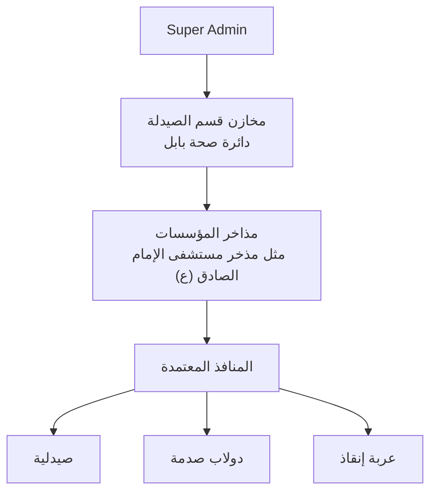
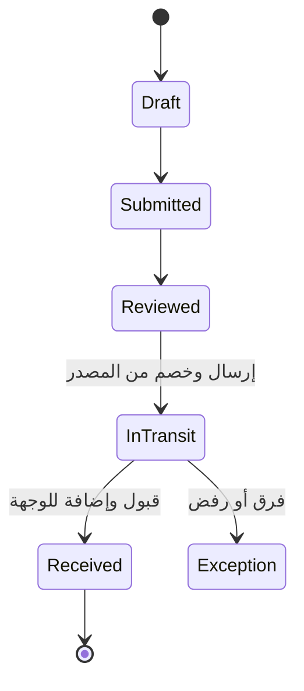

# خريطة MediStock Phoenix قبل التصميم النهائي

> خط أساس التدقيق: `master@354190577ac23815450e7b8ce817517b69544e8b` — 2026-07-18  
> الغرض: فصل **ما يعمل فعليًا اليوم** عن **النظام التشغيلي المعتمد**، وإغلاق الفجوات الوظيفية قبل تطبيق التصميم السينمائي النهائي.

## 1. الخلاصة التنفيذية

قاعدة البيانات تطورت عبر migrations 066–073 إلى نظام مخزون شبكي حقيقي، لكن الواجهة الحالية ما زالت خليطًا من:

1. شاشات قديمة تعتمد `item_availability` والكتابة اليدوية.
2. شاشات جديدة لذكاء المخزون والبحث العام.
3. عمليات مخزنية مكتملة في قاعدة البيانات بلا واجهة تشغيل للمستخدم.

لذلك لا يجوز البدء بإعادة التجميل الشاملة قبل إغلاق مسار التشغيل الظاهر. الخطر الأساسي ليس بصريًا؛ بل أن المستخدم يستطيع إدارة “التوفر اليدوي” بينما الاستلام/الإرسال/الإرجاع الحقيقي غير ظاهر.

## 2. الهيكل التشغيلي المعتمد

### قواعد الملكية والتسمية

- الاسم الافتراضي للمستوى المركزي: **مخازن قسم الصيدلة - دائرة صحة بابل**، مع قابلية تسمية كل مخزن وتعديله.
- المذخر الفرعي يسمى باسم المؤسسة، مثل **مذخر مستشفى الإمام الصادق (ع) التعليمي**.
- المنفذ له اسم قابل للتعديل ونوع حصري: `pharmacy` أو `crash_cabinet` أو `rescue_cart`.
- كل منفذ مرتبط بنيويًا بمذخر مؤسسة واحد.
- كل مستخدم يعمل ضمن المؤسسة/المخزن/المنفذ المسند إليه، عدا `super_admin`.

## 3. الحقيقة التشغيلية في قاعدة البيانات

| المجال | الحقيقة الحالية | الحالة |
|---|---|---|
| مخزون المخازن | `warehouse_stock` + `warehouse_stock_movements` | مطبق |
| المتاح | `available_quantity = on_hand_quantity - reserved_quantity` GENERATED | مطبق |
| مخزون المنافذ | `outlet_stock` + `outlet_stock_movements` | مطبق |
| مركزي → مؤسسة | طلب/مراجعة/إرسال/استلام في 068 | مطبق |
| مؤسسة → مركزي | إرجاع/استدعاء/حجر في 069 | مطبق |
| مؤسسة → منفذ | مسودة/إرسال/استلام في 070 + 067 | مطبق |
| منفذ → مؤسسة | طلب/مراجعة/إرسال/استلام في 071 | مطبق |
| الحجر | `warehouse_quarantine_stock` وسجل حركاته | مطبق |
| ذكاء المخزون | حدود/تنبيهات/توصيات FEFO في 072 | مطبق |
| قرب النفاذ | سياسة ثابتة 270 يومًا في 073 | مطبق |
| البحث العام | مخزون المخازن والمنافذ للمشرف العام | مطبق في الواجهة |
| Excel | تفاصيل + ملخص مؤسسات + تعريفات | مطبق في الواجهة |
| قبول التوصية الذكية | توصية فقط؛ لا تنفيذ أو قبول تلقائي | مقصود أمنيًا |

### دورة الإرسال المعتمدة

لا يضاف الرصيد إلى الوجهة عند إنشاء الطلب أو الإرسال، بل بعد الاستلام/القبول المصرح به.

## 4. البرنامج الظاهر حاليًا

| رقم الشاشة | الشاشة | مصدرها الفعلي | ملاحظة |
|---:|---|---|---|
| 3 | محرر التوفر | `item_availability` وRPC يدوي | جسر قديم؛ يتعارض مع الهدف النهائي |
| 4 | السجل | legacy registry | المسار موجود ومخفي من التنقل |
| 5 | الشبكة | legacy mesh | المسار موجود ومخفي |
| 6 | QR | QR قديم | مخفي من القائمة لكنه ظاهر في لوحة الأوامر |
| 7 | الصحة | شاشة فحص | مخفية |
| 8 | إدخال مجمد | frozen intake | مخفية |
| 9 | التقارير | تقارير قديمة + البحث العام + Excel | رابط `super_admin` أعيد |
| 10 | قيادة الهاتف | legacy mobile command | مخفية |
| 11 | المؤسسات | مؤسسات + مستخدمون + منافذ + توفر يدوي | لا تدير شبكة المخازن الجديدة |
| 12 | مركز المواقف | توفر حي + سجل + ذكاء المخزون | الشاشة الافتراضية الحالية |
| 13 | تنبيهات بين المؤسسات | 036–041 | مطبق |
| 14 | المستخدمون | أدوار قديمة + مصفوفة صلاحيات | لا تدير نطاقات المخزن/المنفذ الجديدة |
| 15 | حسابي | الحساب والاتصال وكلمة المرور | مطبق |
| 16 | محرر الحالة | legacy | مخفي |

### عناصر التنقل الحالية

- سطح المكتب/Drawer: المؤسسات، مركز المواقف، التقارير للمشرف العام، تنبيهات المؤسسات، المستخدمون، محرر التوفر، حسابي.
- الهاتف السفلي: مركز المواقف، محرر التوفر، المؤسسات، التنبيهات.
- لوحة الأوامر تعرض أيضًا QR والتقارير؛ ولا تطابق جميع قيود القائمة الرئيسية.

## 5. نموذج الأدوار: الحالي مقابل المعتمد

| المجال | الواجهة الحالية | القاعدة/الهدف | النتيجة |
|---|---|---|---|
| المشرف العام | `super_admin` | `super_admin` | متطابق |
| مسؤول المؤسسة | `institution_admin` | `institution_admin` | متطابق جزئيًا |
| مسؤول المذخر | `warehouse_officer` + legacy `warehouse_manager` | `warehouse_officer` | موجود لكن بلا واجهة عمليات |
| مسؤول المركزي | غير معرف رسميًا في الواجهة | `central_warehouse_manager` | فجوة حرجة |
| مسؤول المنفذ | `port_officer` + legacy `point_operator` | `outlet_officer` | عدم تطابق |
| إسناد النطاق | مؤسسة فقط في إدارة المستخدمين | warehouse/outlet assignments | غير موجود في الواجهة |
| RBAC scoped enforcement | OFF/Shadow | يبقى OFF حتى telemetry واختبارات حقيقية | مقصود |

## 6. سجل الأخطاء والفجوات

### P0 — تمنع إعلان اكتمال النظام

1. **إنشاء المنفذ غير صالح للنظام الجديد:** الواجهة تنشئ `point_type='dispensing'` دون `warehouse_id`، بينما مخزون المنافذ يقبل فقط الأنواع الثلاثة المعتمدة ويتطلب الاقتران بالمذخر.
2. **لا واجهة لعمليات 067–071:** الطلب والاستلام والإرسال والإرجاع والحجر موجودة في القاعدة فقط.
3. **لا واجهة لإدارة المخازن ومسارات التجهيز:** لا يمكن إنشاء/تسمية/ربط المخازن من الواجهة التشغيلية المعتمدة.
4. **الأدوار والنطاقات الجديدة غير قابلة للإدارة:** `central_warehouse_manager` و`outlet_officer` وإسناد warehouse/outlet غير موجودة في واجهة المستخدمين.
5. **المسار اليدوي ما زال أساسيًا:** محرر التوفر وكتابات `item_availability` القديمة لا تزال في القائمة، لذلك Contract inventory-only غير جاهز.

### P1 — أخطاء وصول/دلالة

6. لوحة الأوامر تعرض التقارير لغير `super_admin` رغم أن القائمة الرئيسية تقيدها.
7. نوع `PointType` في الواجهة ما زال يحصر القيم القديمة، ويعرض storage/returns/emergency بدل الأنواع المعتمدة.
8. نوع `AvailabilityCondition` في TypeScript لا يشمل `unknown` و`not_stocked`.
9. كتالوج الصلاحيات المرئي قديم ولا يعرض مفاتيح 066–072، رغم أن القاعدة تملكها.
10. تسميات “Ports/نقاط التوزيع” و“المستودعات” لا تطابق المصطلحات المعتمدة “المنافذ/المذاخر”.

### P2 — وظائف معتمدة لم تنفذ بعد

11. OCR الاختياري مع شاشة مراجعة بشرية، بلا حفظ الصور.
12. نافذة التنبيه الذكي السينمائية القابلة للتخطي؛ الموجود حاليًا ملخص وظيفي بسيط.
13. لوحة المعلومات الحية وخريطة الشبكة ثلاثية الأبعاد.
14. شاشة الترحيب الحركية وطائر الفينيكس والأيقونات.
15. التصميم النهاري/الليلي السينمائي النهائي.
16. Contract migration لإيقاف الكتابة اليدوية، بعد نشر كل واجهات العمليات واختبارها فقط.

### خارج النطاق حسب القرار

- لا WhatsApp للتنبيهات.
- لا كاميرا حرارية للجرد.
- لا تنفيذ تلقائي لتوصيات التحويل.
- لا صور OCR أو blobs في Supabase.

## 7. البرنامج المستهدف قبل التجميل

| الوحدة | المستخدمون | الوظائف |
|---|---|---|
| لوحة المعلومات | حسب النطاق | مؤشرات حية، تنبيهات، خريطة تدفق |
| شبكة المخازن | super_admin | إنشاء/تسمية/تعديل المركزي والمذاخر والمسارات |
| عمليات المركزي | super_admin + central manager المسند | استلام خارجي، مراجعة طلبات، إرسال، استلام إرجاع، حجر |
| عمليات مذخر المؤسسة | institution admin/warehouse officer المسند | طلب، استلام، صرف للمنفذ، جرد، تصحيح، إرجاع |
| عمليات المنفذ | outlet officer المسند | استلام، صرف، جرد، إرجاع |
| ذكاء المخزون | حسب النطاق | missing/low/surplus/expiry، توصيات فقط |
| البحث العام | super_admin فقط | مادة عبر مؤسسة/مجموعة/الكل + Excel |
| المستخدمون والنطاقات | super_admin وحسب التفويض | دور + مؤسسة + مخزن/منفذ + overrides |
| OCR | مستخدمو الإدخال المخولون | استخراج مسودة ثم مراجعة واعتماد |
| التدقيق والتقارير | حسب الصلاحية | حركات، فروقات، حجر، Excel |

## 8. خطة الإغلاق قبل التصميم النهائي

### المرحلة A — سلامة الهيكل الظاهر

- إصلاح أنواع المنافذ والاقتران الإلزامي بالمذخر.
- توحيد التنقل وقيود العرض.
- تحديث الأنواع والتسميات دون تغيير بيانات قائم.
- إبقاء الصفوف legacy قابلة للعرض وإجبار التصحيح عند تعديلها.

### المرحلة B — إدارة الشبكة والمستخدمين

- شاشة مخازن قسم الصيدلة والمذاخر ومسارات التجهيز.
- دعم الأدوار الجديدة.
- إدارة `profile_scope_assignments` للمخزن والمنفذ.
- مصفوفة صلاحيات جديدة متطابقة مع مفاتيح القاعدة.

### المرحلة C — واجهات العمليات

- مركزي → مؤسسة.
- مؤسسة → منفذ.
- مسارا الإرجاع.
- مخزون/حركات/FEFO/حجر/جرد/تصحيح.
- قبول الاستلام قبل الإضافة.

### المرحلة D — إنهاء legacy

- تحويل كل الشاشات القارئة إلى truth tables.
- إخفاء ثم حذف مسارات التوفر اليدوي.
- smoke tests حقيقية للأدوار والنطاقات.
- Contract migration أخيرة، ثم التفكير في تفعيل RBAC تدريجيًا.

### المرحلة E — OCR

- يدوي أو OCR باختيار المستخدم.
- OCR ينتج Draft فقط.
- مراجعة الحقول والثقة والتعارضات.
- الاعتماد يستدعي RPC التشغيلية نفسها.
- حفظ النتائج النصية وسجل التدقيق فقط، لا الصور.

### المرحلة F — التصميم السينمائي

- نظام تصميم موحد، نهاري/ليلي، RTL/LTR.
- لوحة معلومات حية ثلاثية الأبعاد مرتبطة بالبيانات الحقيقية.
- تنبيه احترافي قابل للتخطي.
- شاشة دخول وترحيب Phoenix وأيقونات PWA/سطح المكتب.
- Progressive enhancement و`prefers-reduced-motion` ووضع أداء منخفض.

## 9. معايير الجاهزية للتصميم النهائي

لا يبدأ التحويل البصري الشامل قبل تحقق الآتي:

- [ ] إنشاء مخزن/مذخر/منفذ صحيح من الواجهة.
- [ ] إسناد مسؤول لكل مخزن ومنفذ واختبار المنع خارج النطاق.
- [ ] دورة central→institution كاملة من الواجهة.
- [ ] دورة institution→outlet كاملة من الواجهة.
- [ ] مسارا الإرجاع والحجر يعملان من الواجهة.
- [ ] كل إضافة رصيد تحدث بعد قبول الاستلام.
- [ ] لا شاشة إنتاج تكتب `item_availability` يدويًا.
- [ ] البحث العام وExcel وذكاء المخزون لا يتراجعان.
- [ ] اختبارات desktop/mobile وAR/EN وRTL/LTR.
- [ ] قياس أثر الاستعلامات على خطة Supabase المجانية.

## 10. قرار التدقيق

**قاعدة البيانات جاهزة كأساس قوي، لكن المنتج المرئي ليس مكتملًا تشغيليًا بعد.**  
الأولوية الصحيحة: سلامة الهيكل → إدارة النطاقات → واجهات العمليات → إيقاف legacy → OCR → التصميم السينمائي النهائي.
